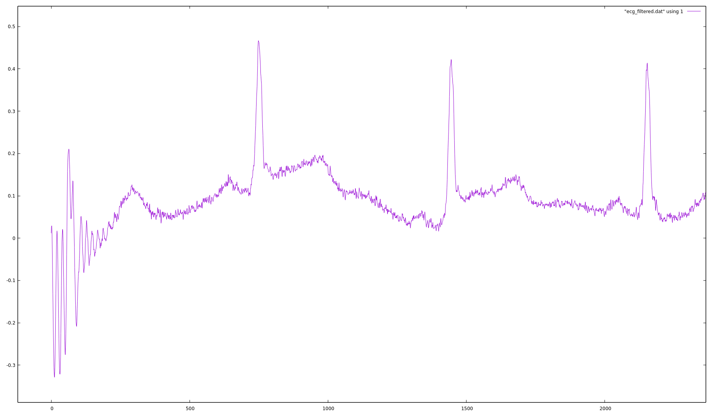

# ECG 50 Hz noise removal with DNF



## How to use

Run:

```
./ecg_test
```

which generates `ecg_filtered.dat`. Data format: `error input canceller`.
The error column is also the signal with 50Hz removed.

Then plot it with gnuplot:

```
gnuplot
plot "ecg_filtered.dat" using 1 w l
```
